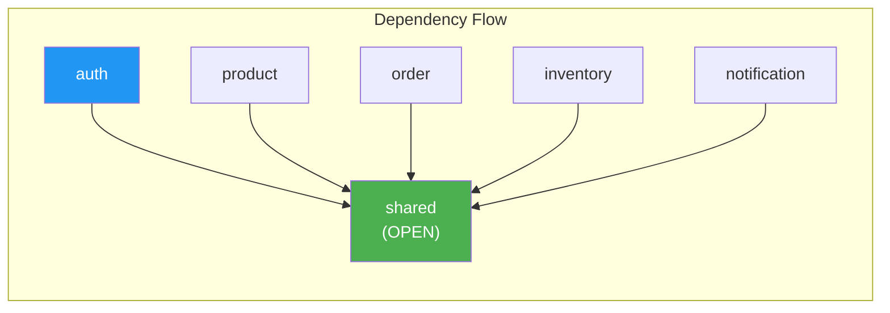

# Module Structure

## Project Structure

```text
tempo-core/
├── src/main/java/com/tempo/core/
│   ├── TempoApplication.java      # Main entry point
│   ├── config/                    # Application configuration
│   │   ├── JpaAuditingConfig.java
│   │   └── WebConfig.java
│   ├── shared/                    # Shared Kernel (OPEN module)
│   │   ├── domain/
│   │   │   ├── entity/            # Base entities (6 classes)
│   │   │   ├── event/             # DomainEvent interface
│   │   │   ├── exception/         # Business exceptions
│   │   │   ├── rule/              # BusinessRule interface
│   │   │   ├── tenant/            # TenantContext utilities
│   │   │   └── vo/                # Value Objects (Money, Email, PhoneNumber)
│   │   └── infrastructure/
│   │       ├── error/             # GlobalExceptionHandler
│   │       ├── event/             # Event infrastructure
│   │       ├── persistence/       # JPA converters
│   │       ├── security/          # Security utilities
│   │       └── tenant/            # Tenant filter, context
│   ├── auth/                      # Authentication Module
│   ├── product/                   # Product catalog (placeholder)
│   ├── order/                     # Order management (placeholder)
│   ├── inventory/                 # Inventory management (placeholder)
│   └── notification/              # Notifications (placeholder)
├── src/main/resources/
│   ├── application.yml
│   └── db/migration/              # Flyway migrations
└── src/test/java/
```

## Module Dependencies (Spring Modulith)



- **`shared`**: Type `OPEN` - accessible by all modules, contains no business logic
- **`auth`**: Declared dependency on `shared` only via `@ApplicationModule(allowedDependencies = {"shared"})`
- **Other modules**: Placeholder modules for future development

---

## Layer Structure per Module

Each business module follows DDD layered architecture with **CQRS pattern**:

```text
{module}/
├── application/           # Application Layer (Use Cases)
│   ├── model/             # DTOs
│   │   ├── request/       # Input DTOs (commands)
│   │   └── response/      # Output DTOs (queries)
│   └── service/           # Application Services
│       ├── {Module}ReadService.java   # Query operations (read-only)
│       ├── {Module}WriteService.java  # Command operations (mutations)
│       └── {Module}Mapper.java        # MapStruct interface
├── domain/                # Domain Layer (Business Logic)
│   ├── model/             # Entities, Aggregate Roots, Enums
│   ├── repository/        # Repository interfaces
│   ├── rule/              # Business rules (BusinessRule pattern)
│   └── event/             # Domain events
├── infrastructure/        # Infrastructure Layer
│   └── persistence/       # JPA repository implementations
├── interfaces/            # Interface Layer (Entry Points)
│   └── rest/              # REST controllers
└── job/                   # Background jobs
```
