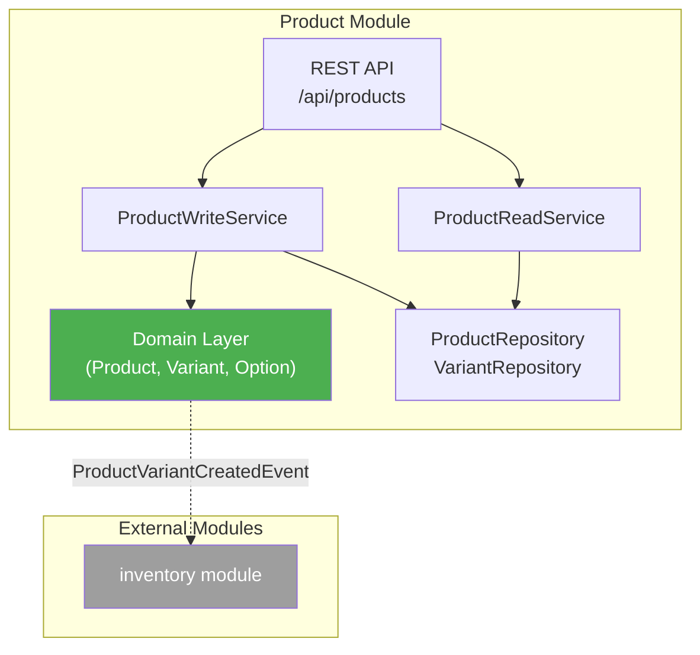
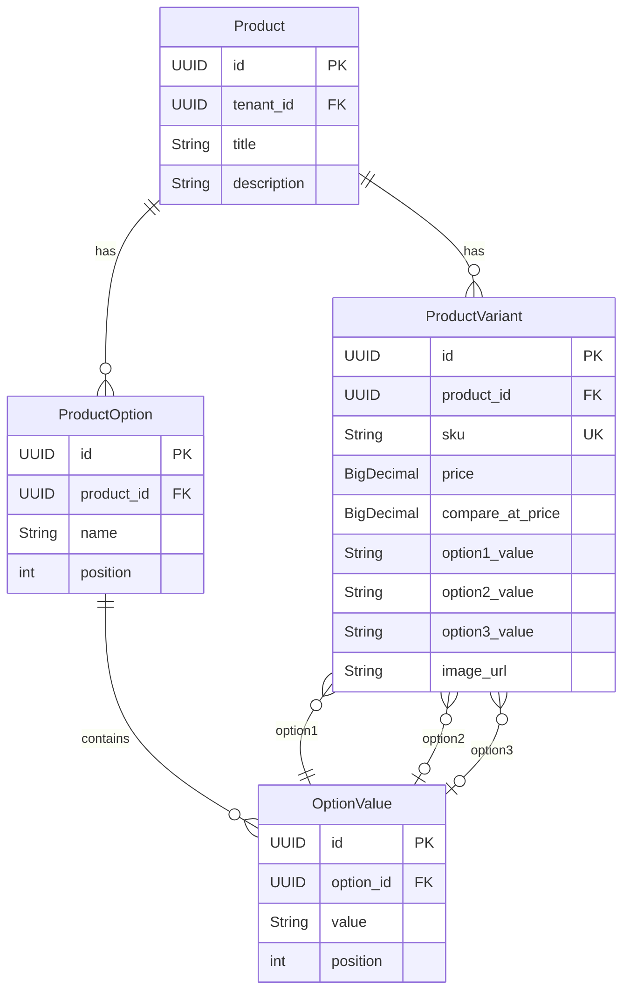

# Product Module - Architecture

> **Last Updated**: 2026-01-05

## Tổng quan

Module `product` cung cấp giải pháp quản lý sản phẩm linh hoạt theo mô hình Shopify, hỗ trợ đa biến thể (Variants) dựa trên các thuộc tính (Options) tùy chỉnh. Module này tuân thủ kiến trúc **Modular Monolith** và các patterns đã được thiết lập trong Tempo-Core.

---

## High Level Architecture



### Architectural Patterns

| Pattern | Mô tả | Rationale |
| ------- | ----- | --------- |
| **CQRS** | Tách Read/Write Services | Tối ưu query, dễ scale |
| **Domain Events** | `ProductVariantCreatedEvent` → Inventory | Loose coupling giữa modules |
| **Aggregate Root** | Product là Aggregate Root chứa Options & Variants | Đảm bảo invariants |
| **Factory Method** | `Product.create()`, `Variant.create()` | Encapsulate business rules |

---

## Data Models

### Entity Relationship



### Domain Entities

| Entity | Base Class | Mô tả |
| ------ | ---------- | ----- |
| `Product` | `TenantAggregateRoot<UUID>` | Aggregate Root - sản phẩm gốc |
| `ProductOption` | `BaseEntity<UUID>` | Thuộc tính (Color, Size...) |
| `OptionValue` | `BaseEntity<UUID>` | Giá trị thuộc tính (Red, Blue...) |
| `ProductVariant` | `TenantAggregateRoot<UUID>` | Biến thể với SKU unique |

---

## Module Structure

```text
product/
├── application/
│   ├── model/
│   │   ├── request/
│   │   │   ├── CreateProductRequest.java
│   │   │   ├── UpdateProductRequest.java
│   │   │   └── CreateVariantRequest.java
│   │   └── response/
│   │       ├── ProductResponse.java
│   │       ├── ProductDetailResponse.java
│   │       └── VariantResponse.java
│   └── service/
│       ├── ProductReadService.java
│       ├── ProductWriteService.java
│       └── ProductMapper.java
├── domain/
│   ├── model/
│   │   ├── Product.java
│   │   ├── ProductOption.java
│   │   ├── OptionValue.java
│   │   └── ProductVariant.java
│   ├── repository/
│   │   ├── ProductRepository.java
│   │   └── VariantRepository.java
│   ├── rule/
│   │   ├── SkuMustBeUniqueRule.java
│   │   ├── MaxThreeOptionsRule.java
│   │   └── VariantMustBelongToProductRule.java
│   └── event/
│       └── ProductVariantCreatedEvent.java
├── infrastructure/
│   └── persistence/
│       ├── JpaProductRepository.java
│       └── JpaVariantRepository.java
└── interfaces/
    └── rest/
        └── ProductController.java
```

---

## Domain Events

### ProductVariantCreatedEvent

Khi Variant được tạo thành công, event được phát để module `inventory` tự động tạo inventory record.

```java
@TypeAlias("product.variant-created")
public record ProductVariantCreatedEvent(
    UUID variantId,
    String sku,
    UUID productId,
    UUID tenantId
) implements DomainEvent {}
```

**Listener (inventory module):**
```java
@ApplicationModuleListener(id = "inventory.on-variant-created")
public void onVariantCreated(ProductVariantCreatedEvent event) {
    inventoryWriteService.createInventoryItem(event.variantId(), event.sku());
}
```

---

## Business Rules

| Rule Class | Mô tả |
| ---------- | ----- |
| `SkuMustBeUniqueRule` | SKU phải unique toàn hệ thống |
| `MaxThreeOptionsRule` | Tối đa 3 Options/Product |
| `VariantMustBelongToProductRule` | Variant phải thuộc Product |
| `PriceMustBePositiveRule` | Giá phải > 0 |

---

## REST API Endpoints

| Method | Endpoint | Mô tả |
| ------ | -------- | ----- |
| `GET` | `/api/products` | Danh sách sản phẩm |
| `GET` | `/api/products/{id}` | Chi tiết sản phẩm (kèm variants) |
| `POST` | `/api/products` | Tạo sản phẩm mới |
| `PUT` | `/api/products/{id}` | Cập nhật sản phẩm |
| `DELETE` | `/api/products/{id}` | Xóa sản phẩm (cascade variants) |
| `POST` | `/api/products/{id}/variants` | Thêm variant |
| `PUT` | `/api/products/{id}/variants/{variantId}` | Cập nhật variant |

---

## Database Migration

File: `V5__product_module.sql`

```sql
-- Products table
CREATE TABLE products (
    id UUID PRIMARY KEY,
    tenant_id UUID NOT NULL,
    title VARCHAR(255) NOT NULL,
    description TEXT,
    created_at TIMESTAMP NOT NULL,
    updated_at TIMESTAMP NOT NULL,
    created_by VARCHAR(255),
    updated_by VARCHAR(255),
    version BIGINT DEFAULT 0
);

-- Product Options
CREATE TABLE product_options (
    id UUID PRIMARY KEY,
    product_id UUID NOT NULL REFERENCES products(id) ON DELETE CASCADE,
    name VARCHAR(100) NOT NULL,
    position INT NOT NULL DEFAULT 0
);

-- Option Values
CREATE TABLE option_values (
    id UUID PRIMARY KEY,
    option_id UUID NOT NULL REFERENCES product_options(id) ON DELETE CASCADE,
    value VARCHAR(255) NOT NULL,
    position INT NOT NULL DEFAULT 0
);

-- Product Variants
CREATE TABLE product_variants (
    id UUID PRIMARY KEY,
    tenant_id UUID NOT NULL,
    product_id UUID NOT NULL REFERENCES products(id) ON DELETE CASCADE,
    sku VARCHAR(100) NOT NULL UNIQUE,
    price DECIMAL(19,2) NOT NULL,
    compare_at_price DECIMAL(19,2),
    option1_value VARCHAR(255),
    option2_value VARCHAR(255),
    option3_value VARCHAR(255),
    image_url VARCHAR(500),
    created_at TIMESTAMP NOT NULL,
    updated_at TIMESTAMP NOT NULL,
    version BIGINT DEFAULT 0
);

-- Indexes
CREATE INDEX idx_products_tenant ON products(tenant_id);
CREATE INDEX idx_variants_tenant ON product_variants(tenant_id);
CREATE INDEX idx_variants_product ON product_variants(product_id);
CREATE UNIQUE INDEX idx_variants_sku ON product_variants(sku);
```

---

## Acceptance Criteria Mapping

| PRD Criteria | Implementation |
| ------------ | -------------- |
| Tạo "Áo thun" với Color, Size | `POST /api/products` với options array |
| Sinh 4 biến thể | `ProductWriteService.generateVariants()` |
| Log event thành công | Spring Modulith `event_publication` table |
| Trùng SKU → 400 | `SkuMustBeUniqueRule` throws `BusinessException` |
